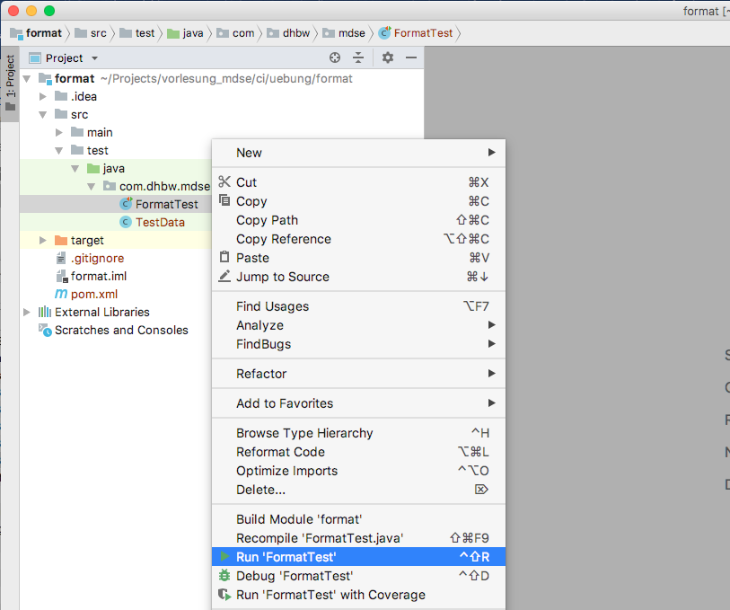

# Übung: Formate

### 1. Projektsetup
1. Nutzen Sie `git clone` um das Github Repository [https://github.com/hellerchr/mdse2021](https://github.com/hellerchr/mdse2021) zu klonen.
2. Öffnen Sie den Projektordner **format** (Unterordner in *mdse/ci/uebung*) in *IntellIJ*.
3. Führen Sie mit Rechtsklick auf *FormatTest* die Unit Tests aus.

Die drei ausgeführten Tests (*xml, json, yaml*) sollten fehlschlagen. Mit dem korrekten lösen der folgenden Aufgabe, lässt sich das beheben.

### 2. *Student*

Ihre Aufgabe ist es den Stundenten *Max Muster* in den drei vorgestellten Formaten (xml, json, yaml) zu modellieren.

Die zu modellierende Struktur *student* soll folgende Felder besitzen:

* name: *Max Muster*
* age: 22
* university: *DHBW Mannheim*
* courses
	* name: *mdse*, examType: *presentation*
	* name: *java*, examType: *test* 

Beachten Sie dabei, dass *courses* als Wiederholgruppe modelliert werden soll um potentiell mehrere Kurse an einen Datensatz anzuhängen.

Bearbeiten Sie folgende Dateien und führen Sie die Unit Tests aus um das Ergebnis zu überprüfen:

##### 2.1) XML
Implementieren Sie die Struktur in der XML-Datei **student.xml** in *src/main/resources/*. Stellen Sie das korrekte Ergebnis sicher indem Sie den Unit Test *xml* ausführen.

##### 2.2) JSON
Implementieren Sie die Struktur in der XML-Datei **student.json** in *src/main/resources/*. Stellen Sie das korrekte Ergebnis sicher indem Sie den Unit Test *json* ausführen.

##### 2.3) YAML
Implementieren Sie die Struktur in der YAML-Datei **student.yml** in *src/main/resources/*. Stellen Sie das korrekte Ergebnis sicher indem Sie den Unit Test *yaml* ausführen.

Viel Erfolg!

